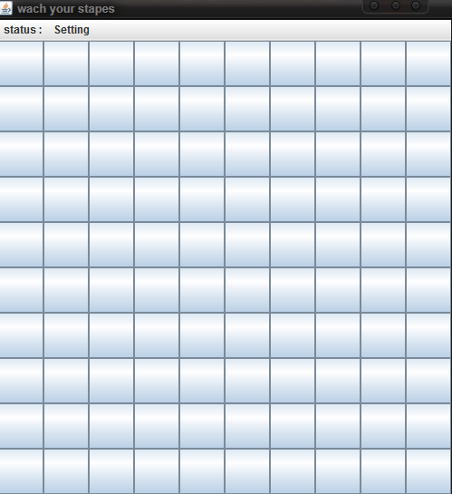

# Watch Your Step, there is BOMB! here
### Guid
a simple project to demonstrate a particle effect using java

#### How to run
make sure you have java 8+ and java Fx configure then just run the the main class. everything should work fine.

### Game Rule
* You will start with 10 x 10 grid cell
* 10 cell will be chosen randomly to hold a  bomb, the goal is to unmask all the cell without touching the bomb
* each cell will have a number on it, indicating how many of its neighbour is actually a bomb.

### Demo

